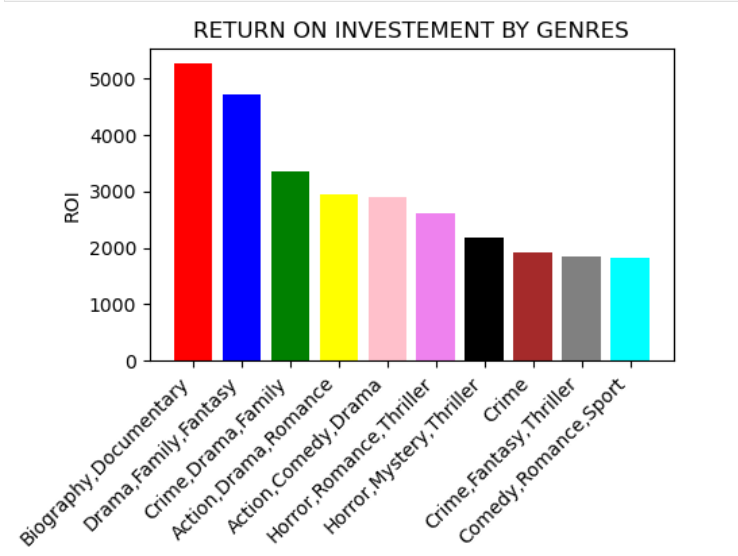
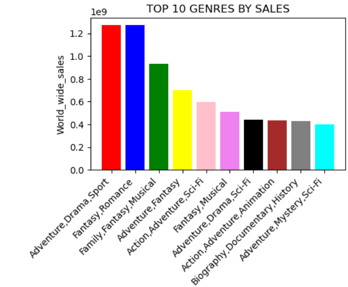
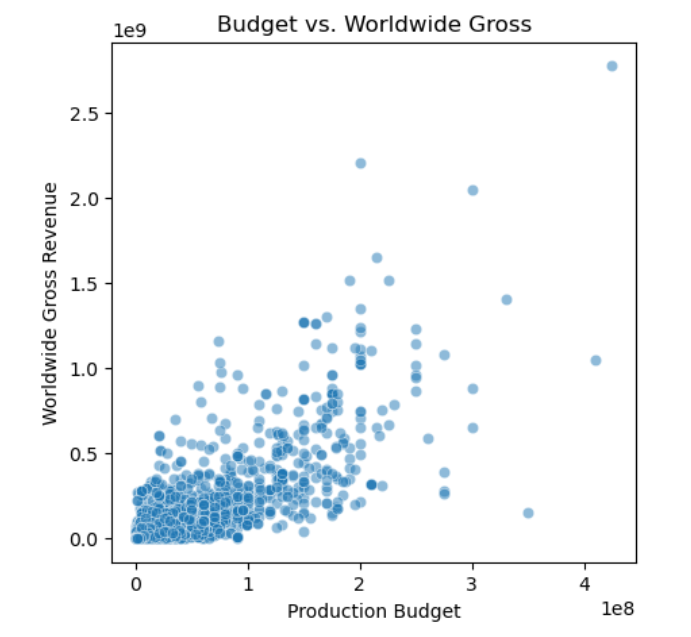
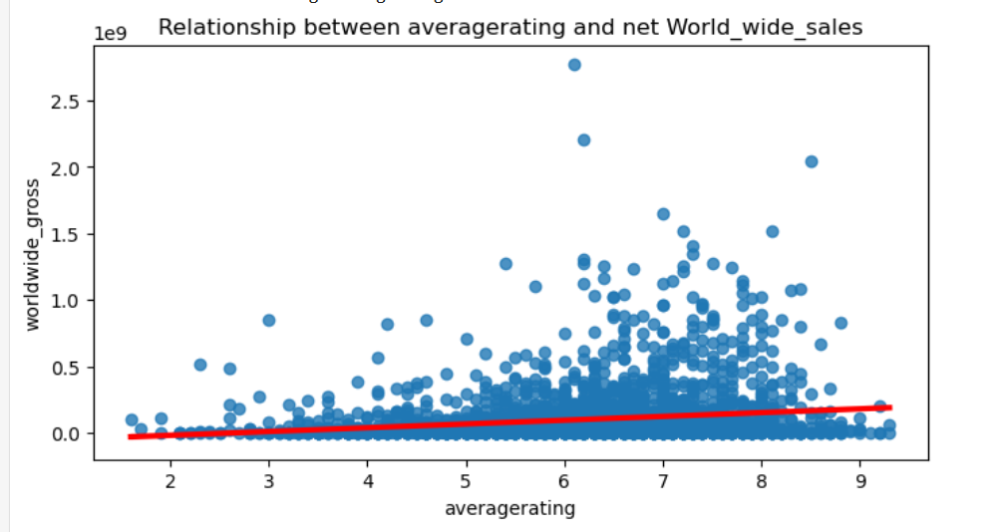

# 1.0 Project Overview 
With the rise of original video content among major corporations, our company has decided to establish its own movie studio. However, since we lack experience in film production, it is crucial to understand current trends to make informed decisions.To answer provide support to management,we  will use exploratory data analysis to generate insights for a business stakeholder.

### Business Understanding
As part of the 5 year corporate strategy roll out,our company has identified an expansion opportuntiy.
The company wants  to  venture in  original video content creation through their new studio.
The company management has an interest in utising data on films at  the box office to identify  best movies. 
From the best movies, the company management is loking for insights that will influence the investment approach to take.  

### Objectives:
Our review is focused on identifying the below factors that would influence the market penetration strategy:
	Identifying the top 10 best performing genres based on the return on investment and sales.  
	Identifying the top 10 best performing gmovies based on the return on investment and sales.  
	Identifying  relationship between production cost and the global film sales.    
	Identifying the impact of movie rating on the global film sales

### The Data

The data was obtained form the below sources:  
Box Office Mojo: https://www.boxofficemojo.com/  
IMDB : https://www.imdb.com/  
The Rotten Tomatoes : https://www.rottentomatoes.com/   
The Movie DB: https://www.themoviedb.org/  
The numbers: https://www.the-numbers.com/  

### Summary of Findings:
All the top 10 genres have a retun on investement of over 1000%. The most profitable genre to invest in is Biography,Documentary.

All the top 10 most profitable genres based on return on investement do not feature in the top ten movies by global sales.  
Genres with top 10 sales are not the most profitale to invest in.

Most movies spent less funds on production budget and consequently registered lower sales.

Investing in quality movies that will attract higher ratings will have a moderate postive impact on the global sales.

### Recommedations:
The company should:
Invest in high-quality action, adventure, and family-friendly genres which will yield high returns on investment.  
Spend more on production costs as this may maximize sales by up to 60.5% .  
Focus on quality films which will attract higher ratings in the market to increase sales.  

